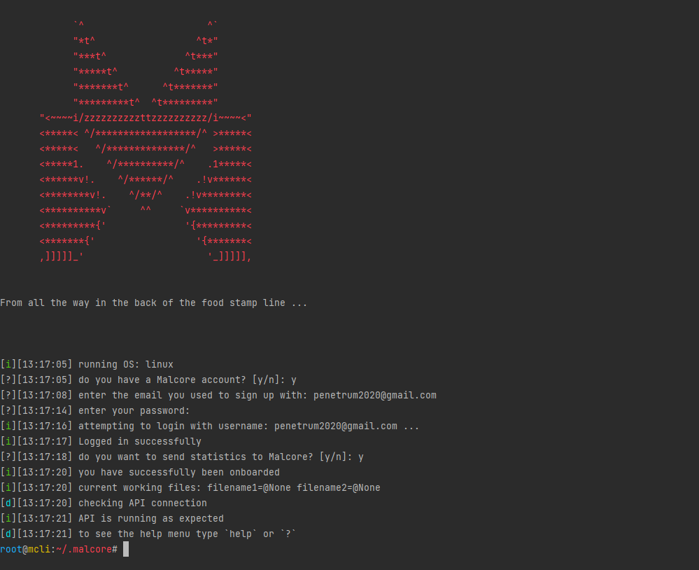
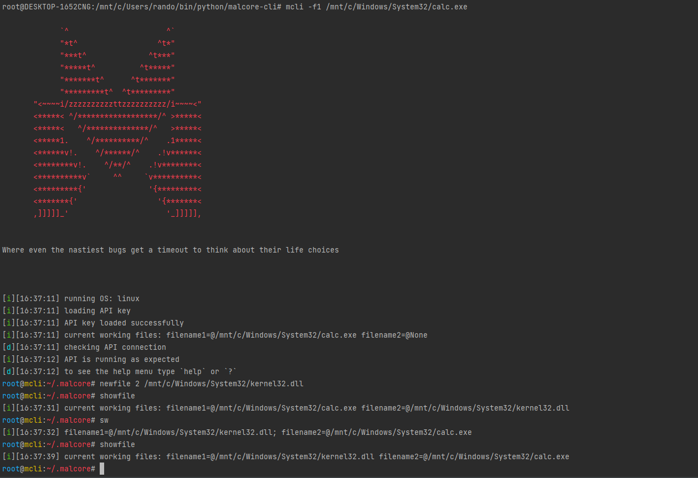
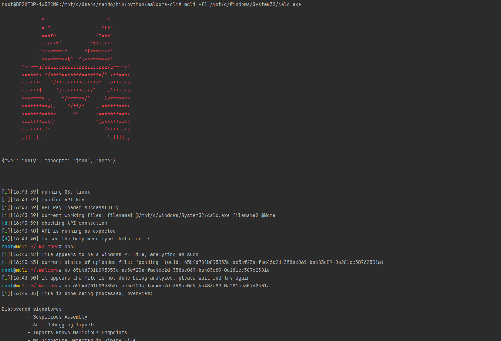

<p align="center" width="100%"></p>

mCLI is a CLI tool used to analyze malware using Malcore directly from your terminal. This allows easy and quick analysis and integration.

# Installation

```bash
git clone https://github.com/Internet-2-0/mCLI.git && \
  cd mCLI && \
  python setup.py install && \
  mcli
```
That's pretty much it.

# Usage

mCLI can be used as a terminal tool and be passed flags to perform analysis as well as drop into its own terminal view to begin analysis. The CLI flags are as follows:

```
usage: mcli [-h] [--wizard] [-f1 WORKINGFILE1] [-q] [--external-path IMPORTEXTERNAL] [-f2 WORKINGFILE2] [--group-by {5,10,15}] [--reload] [--hide] [--del-all] [--version]

optional arguments:
  -h, --help            show this help message and exit
  --wizard              Drop into the mCLI terminal, this is default
  -f1 WORKINGFILE1, --filename1 WORKINGFILE1
                        Set the working file filename1 to this file and continue
  -q, --quick-analysis  Don't drop into the terminal and perform an analysis of the passed working file and exit
  --external-path IMPORTEXTERNAL
                        Pass external paths to load external commands into the terminal. Must use a comma between paths
  -f2 WORKINGFILE2, --filename2 WORKINGFILE2
                        Set the working file filename2 to this path
  --group-by {5,10,15}  Edit the group by integer for code reuse
  --reload              Reload your API key
  --hide                Hide the welcome banner
  --del-all             Completely remove the mCLI home path
  --version             Show program version and exit          
```

And the terminal flags are as follows:

```
Available Commands:             Description:
------------------              ------------

help|?                          Print this help
sea[rch]|check|uu[id] [UUID]    Provide a UUID to check the status of your upload
anal[ysis|yze]                  Start full analysis on the current working file
hash[sum|es]                    Gather hashsums of the current working file
ca[che]|sho[w]                  Show the current stored UUID's
new[file] [*1|2] [FILE]         Pass to change the current working files
showfile                        Pass to show the current working files
ext[ernal]                      View integrated external commands
re[use]                         Pass to perform code reuse analysis on two files
groupby [*5|10|15]              Pass to change the 'group_by' integer for code reuse analysis
ex[if]                          Gather exif data from the current working file
[api]key                        View your current saved API key
ex[it]|qu[it]                   Pass this to exit the terminal
del[ete] UUID                   Manually remove a UUID from the cache list
vi[ew]                          List your available endpoints with your plan and your scans per month
[file]sw[ap]                    Swap working files, filename1 -> filename2; filename2 -> filename1
ping                            Ping the Malcore API to see if it's online
ver[sion]                       Show current program version
```

This allows users to perform quick analysis on files as well as analyze multiple files at a time

# Examples

Upon launching mCLI the first time you will be asked if you have a Malcore account. If you have one you can login directly from the terminal and go from there, otherwise you will need to register one:



mCLI allows you to easily view and start working on files by either passing the file via the command line flags, or using the terminal to choose your working files:



Analyzing the files is as simple as starting the analysis and waiting for it to finish, if you just want to perform a quick analysis you can do so by passing certain command line flags:



# Contribute

Clone the dev branch and make your own branch, make a PR explaining what you did, why you did it, and how it will help. 

[<br><br><br><br><p align="center" width="100%"></p>](https://link.malcore.io/readme/redirect)

# Issues

Make an [issue on our Github](https://link.malcore.io/readme/issue), and we will get to it as quickly as possible